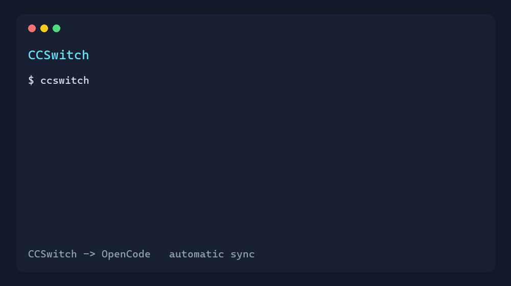

# CCSwitch OpenCode Launcher

[](https://github.com/9527-rain/ccswitch-opencode-launcher/actions/workflows/ci.yml)
[](https://github.com/9527-rain/ccswitch-opencode-launcher/releases/latest)
[](LICENSE)
[](SECURITY.md)
[](COMPATIBILITY.md)

**CCSwitch 切换模型后，OpenCode 下次启动自动同步。**

不用复制 API Key，不用手改 OpenCode 配置。每次运行 `opencode-ccswitch`，它都会读取 CCSwitch 当前选中的 provider、模型和推理强度，再启动一个隔离配置的 OpenCode 进程。



## Quick start

### Windows

```powershell
irm https://github.com/9527-rain/ccswitch-opencode-launcher/releases/download/v0.4.0/install.ps1 | iex
opencode-ccswitch
```

### macOS / Linux

```sh
curl -fsSL https://github.com/9527-rain/ccswitch-opencode-launcher/releases/download/v0.4.0/install.sh | sh
opencode-ccswitch
```

安装后，在 CCSwitch 中切换 provider，再重新运行 `opencode-ccswitch` 即可同步。

## Supported platforms

| Platform | Launcher | Requirements |
| --- | --- | --- |
| Windows 10+ | PowerShell | PowerShell 5.1+, CCSwitch, OpenCode, `sqlite3.exe` |
| macOS | Python | Python 3.9+, CCSwitch, OpenCode |
| Linux | Python | Python 3.9+, CCSwitch, OpenCode |

## Before / after

| 手动配置 | 使用本启动器 |
| --- | --- |
| CCSwitch 切换后，复制 Key、地址和模型 | CCSwitch 切换后直接启动 |
| 修改 OpenCode 配置文件 | 自动生成临时配置 |
| 担心 Key 被写入项目或 `auth.json` | Key 只传给当前 OpenCode 子进程 |

## What it does

- Supports CCSwitch's native `opencode` providers and older `codex` providers.
- Reads the active provider, API endpoint, key, default model, and reasoning effort locally.
- Can discover models from an OpenAI-compatible `/models` endpoint when explicitly enabled.
- Uses OpenCode's custom `OPENCODE_CONFIG` override and a per-process temporary config.
- Generates only the launcher-owned provider/model layer; OpenCode's global/project MCP, plugin, permission, and agent settings remain in place through OpenCode's config merge.
- Passes the API key to the OpenCode child process and restores the parent environment afterwards; it does not write `auth.json` or print the key.
- Keeps your regular OpenCode configuration untouched.

## Requirements

### Windows

- Windows 10 or later
- CCSwitch and OpenCode
- PowerShell 5.1 or later
- `sqlite3.exe` on `PATH` (the launcher also checks a standard Anaconda and WinGet location)

### macOS/Linux

- Python 3.9 or later
- CCSwitch and OpenCode

CCSwitch stores its data under `%USERPROFILE%\\.cc-switch` on Windows and `~/.cc-switch` on Unix-like systems by default.

## Install (from a clone)

### Windows (PowerShell)

From a cloned repository:

```powershell
powershell -ExecutionPolicy Bypass -File .\\install.ps1
```

One-line install from GitHub:

```powershell
irm https://github.com/9527-rain/ccswitch-opencode-launcher/releases/download/v0.4.0/install.ps1 | iex
```

The installer copies the launcher to `%APPDATA%\\npm` and adds that directory to the user `PATH` when needed. Open a new terminal afterwards if PATH was changed.

### macOS/Linux

From a cloned repository:

```sh
./install.sh
```

One-line install from GitHub:

```sh
curl -fsSL https://github.com/9527-rain/ccswitch-opencode-launcher/releases/download/v0.4.0/install.sh | sh
```

The default install directory is `~/.local/bin`. Add it to `PATH` if the installer reports that it is missing.

## Use

Switch providers in CCSwitch, then run:

```text
opencode-ccswitch
```

All normal OpenCode arguments are forwarded:

```text
opencode-ccswitch run "Inspect this project and add tests"
opencode-ccswitch --model ccswitch/deepseek-chat
```

The launcher does not change an already-running OpenCode session. Start a new session after switching providers.

## Configuration and troubleshooting

By default, the launcher prefers CCSwitch's native `opencode` provider and falls back to the active `codex` provider when no OpenCode provider exists. You can override selection for testing:

```text
opencode-ccswitch doctor
```

Maintenance: `doctor --json` prints stable machine-readable diagnostics; `doctor --strict` returns non-zero when issues exist; `--version` prints the launcher version; `update --version vX.Y.Z` pins an upgrade; `uninstall` removes launcher files.

`doctor` prints the selected provider, model, API base URL, dependency status, and whether a key is configured. It never prints the key. Model discovery is disabled by default; enable it only when needed:

```powershell
$env:CCSWITCH_MODEL_DISCOVERY = "best-effort"
opencode-ccswitch
```

`doctor` also reports the detected CCSwitch SQLite schema. Unknown or missing provider columns are rejected before launch instead of producing a misleading configuration.

For a local Windows integration check, run `tests\\windows-integration.ps1` from PowerShell in a checkout.

Preview the sanitized generated configuration without starting OpenCode or contacting the provider:

```text
opencode-ccswitch --dry-run
```

```powershell
$env:CCSWITCH_APP_TYPE = "codex"
$env:CCSWITCH_PROVIDER_ID = "provider-id"
opencode-ccswitch --version
```

Useful overrides:

| Variable | Purpose |
| --- | --- |
| `CCSWITCH_HOME` | Override the CCSwitch data directory |
| `CCSWITCH_DB` | Override the SQLite database path |
| `CCSWITCH_SQLITE` | Explicit path to `sqlite3.exe` on Windows |
| `CCSWITCH_APP_TYPE` | Force `opencode` or `codex` provider selection |
| `CCSWITCH_PROVIDER_ID` | Force a specific provider ID |
| `CCSWITCH_OPENCODE_NPM` | Override the AI SDK package, such as `@ai-sdk/openai` |
| `CCSWITCH_MODEL_DISCOVERY` | `never` (default), `best-effort`, or `required` |
| `OPENCODE_GENERATED_CONFIG` | Keep the generated config at a chosen private path instead of a temporary file |

For a provider that only supports `/v1/responses`, set:

```powershell
$env:CCSWITCH_OPENCODE_NPM = "@ai-sdk/openai"
opencode-ccswitch
```

## Security

API credentials are read locally and passed through a child-process environment variable. Generated configs use a strict option allowlist and do not include provider keys, tokens, secrets, or custom headers. API base URLs cannot contain credentials or query parameters. API discovery is opt-in and uses only the explicit HTTPS API base URL. Do not commit CCSwitch databases, OpenCode credential files, or generated configs.

## License

MIT
